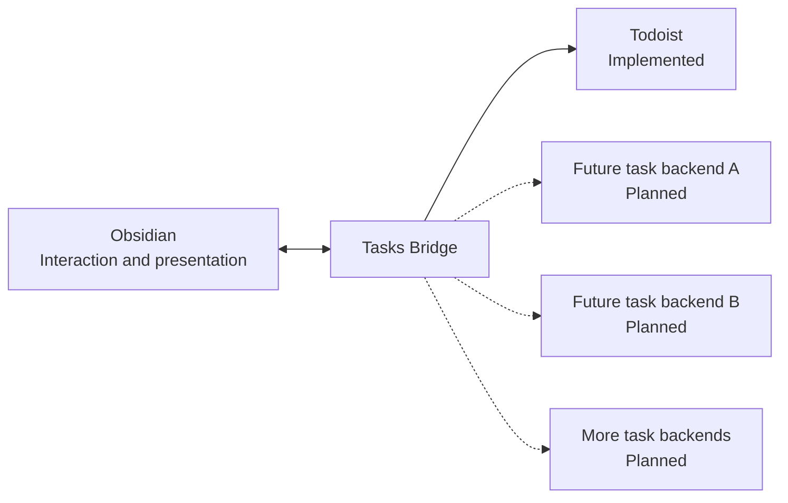

# Obsidian Tasks Bridge

  

Tasks Bridge is based on the original [Todoist Sync](https://github.com/jamiebrynes7/obsidian-todoist-plugin) plugin created by [Jamie Brynes](https://github.com/jamiebrynes7).

## What is it?

**Tasks Bridge** connects Obsidian to external task-management services. Those services are the task backends and systems of record: they remain responsible for primary task storage and synchronization, while Obsidian provides the interaction and presentation layer for viewing, organizing, and updating tasks.

## Architecture

The solid backend connection is available now. Dashed connections are planned integrations. Every task service remains the system of record for its own data.

Todoist is the first supported backend. The current Todoist integration provides two independent workflows:

- **Query blocks** render a Todoist filter inside any note, with cache-first loading and optional completed-task history.
- **Project sync** maps one or more Todoist projects to independent Vault folders. Each selected folder is that project's exact root, optional child projects become nested folders, and every active or completed task becomes a Markdown file that can be managed with [Obsidian Bases](https://help.obsidian.md/bases).

Project sync is a one-way Todoist-to-Obsidian projection. It retrieves complete completed-task history from Todoist's project endpoint, preserves note bodies and properties not managed by the plugin, and does not treat arbitrary Base or Markdown edits as Todoist changes. Its **Tasks List** Base view provides explicit server-backed actions for editing, completing, and reopening tasks. Open task notes are deferred instead of overwritten, and tasks that leave an included child hierarchy are retained as `out_of_scope`. See the [project sync guide](https://haiqiang-zhang.github.io/obsidian-tasks-bridge-plugin/docs/project-mode/).

Every device can run automatic Project sync. Before an automatic projection, Tasks Bridge waits for incoming Obsidian Sync downloads, merges, and remote deletions to finish and briefly settle. Upload-only activity, including uploads triggered by Tasks Bridge's own writes, does not block the next refresh. Manual Project sync remains available immediately. This is local, direction-aware coordination on each device, not a distributed lock or cross-device ownership protocol.

The Todoist integration is not created by, affiliated with, endorsed by, or supported by Doist.

Read the [Tasks Bridge documentation](https://haiqiang-zhang.github.io/obsidian-tasks-bridge-plugin/) for installation, query syntax, and general usage.

## What Tasks Bridge adds to Todoist Sync

Compared with the upstream Todoist Sync codebase, this fork adds:

- Cache-first rendering: previously loaded Todoist blocks appear immediately while fresh data synchronizes in the background.
- An accessible, Obsidian-styled loading indicator when no cached result is available.
- Account-isolated persistent caching with validation, bounded storage, and stale-request protection.
- Reliable task completion with rollback on API failure and consistent updates across cached queries.
- Block actions that no longer overlap Obsidian's built-in **Edit this block** button.
- Compact, consistent layouts for both titled and untitled Todoist blocks.
- Time-zone-correct same-day due-date handling.
- Optional completed-task display with complete cursor pagination and user-controlled three-month history expansion.
- Independent multi-project sync with validated folder mappings, resumable root-folder moves, nested child-project folders, one Markdown file per task, complete active and completed history, and flat `todoist_*` properties for Obsidian Bases.
- Multi-device automatic Project sync that defers for incoming Obsidian Sync file changes without treating local uploads as a conflict.
- A native-styled **Tasks List** Base view with Project → Section → Task → Subtask hierarchy, arbitrary project roots, a GitHub-style daily completion heatmap, native filters/sorts/groups/property order, and controlled Todoist task actions.
- Symlink-safe production builds that preserve the plugin's existing `data.json`.

## Acknowledgements

Tasks Bridge is based on [Todoist Sync](https://github.com/jamiebrynes7/obsidian-todoist-plugin). Thank you to Jamie Brynes and all [upstream contributors](https://github.com/jamiebrynes7/obsidian-todoist-plugin/graphs/contributors) for creating and maintaining the original project.

## Support the original project

If you would like to support Jamie Brynes's work on the original plugin:

