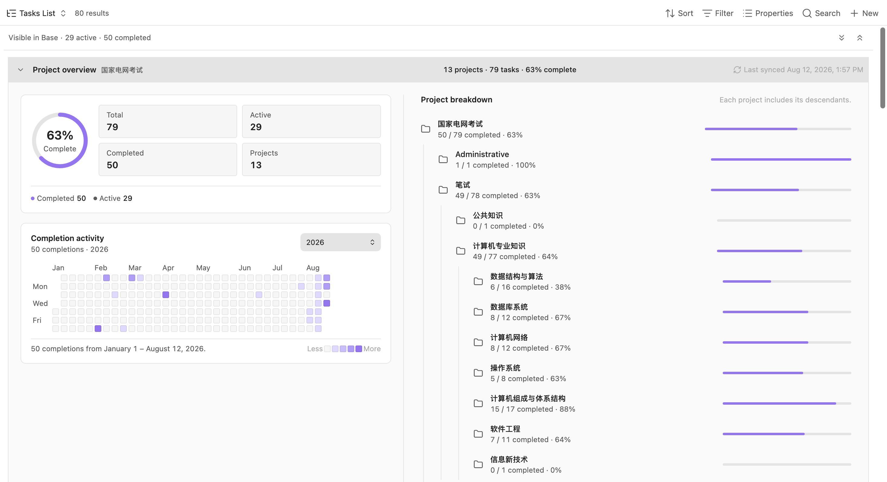

# Project Sync

Project sync is a second mode that is independent of [query blocks](./query-blocks). It creates one or more one-way, file-based Todoist project projections for use with Markdown tools and [Obsidian Bases](https://help.obsidian.md/bases).

Each mapping connects one Todoist project to one existing Vault folder. That Vault folder is the selected project's **exact root folder**: root-project tasks are written directly into it. The plugin does not create another folder named after the root project. If child projects are included, each child becomes a nested folder, and every task becomes one Markdown file.

:::danger Todoist is the source of truth

Project Sync is a one-way Todoist-to-Vault projection. Todoist controls every synchronized task note, but the mapped Vault folder is **not an exclusive mirror by default**. Keep **Preserve unmanaged Vault content** enabled unless the entire mapped folder is intentionally disposable.

Ownership is explicit:

- A Markdown file with a valid `todoist_task_id` is a managed task note. Tasks Bridge continues to update, move, and recoverably delete that note when the corresponding Todoist task changes or is deleted.
- A folder is managed only when Tasks Bridge actually created it and recorded that creation in the plugin's `data.json`. The user-selected mapping root is never recorded as plugin-owned.
- A pre-existing folder may contain synchronized task notes, but it is not adopted as a managed folder. Independent `.base` files, Markdown notes, attachments, and folders remain untouched.
- When Todoist renames, moves, or deletes an item, Tasks Bridge moves or removes the managed task notes first. An obsolete managed folder is moved to the configured Obsidian trash only after a live check proves it is empty. If it contains user content, the old folder remains tracked and is cleaned up only after that content is removed and the folder later becomes empty.
- If multiple Markdown files contain the same immutable `todoist_task_id`, Tasks Bridge keeps one canonical task note and moves every redundant copy to the configured trash.
- Text outside the managed body comments and non-managed frontmatter properties remain preserved inside the canonical task note.
- Tasks Bridge never uses order-dependent numeric suffixes such as `(2)` or `(3)`. Todoist legitimately allows same-level items with the same name, so every member of a true remote collision first receives a readable, portable UTC creation time, for example `Review · 2026-08-17 06.32.05Z.md`. Only items whose creation time is missing or still identical receive an additional stable typed short-ID marker. The result depends on Todoist data, never local file order or Vault occupancy.
- If a user-owned entry occupies an exact required canonical path, Tasks Bridge preserves it and reports the affected task or subtree as blocked. It does not overwrite the entry or invent an order-dependent fallback name. Unrelated Todoist updates and deletions still continue.
- A failed, interrupted, or incomplete Todoist fetch never starts projection or cleanup.

Turning **Preserve unmanaged Vault content** off restores the legacy exclusive-mirror behavior for each current active `mapping.folder`: unrelated entries inside that root may be moved to the configured Obsidian trash. Registered previous roots and inactive or unavailable mappings are never treated as empty snapshots.

When Obsidian Sync is enabled, Tasks Bridge waits for incoming changes to finish before starting a projection. It still runs when Obsidian Sync is disabled, and local-only uploads caused by Tasks Bridge do not postpone the active projection.

Do not copy, reuse, or manually change `todoist_task_id`; that ID is the task-note ownership boundary. Files and empty managed folders moved to trash remain recoverable according to your Obsidian trash settings.

:::

```text
Todoist projects/
├── Work/                              ← mapped directly to Todoist “Work”
│   ├── Prepare quarterly plan/         ← a task with subtasks
│   │   ├── Prepare quarterly plan.md   ← parent task, matching its folder name
│   │   ├── Draft milestones.md         ← direct subtask
│   │   └── Review owners/              ← a subtask with its own children
│   │       ├── Review owners.md
│   │       └── Confirm launch owner.md
│   └── Product launch/                ← child Todoist project
│       └── Publish release notes.md
└── Personal/                          ← a second independent mapping
    └── Renew passport.md
```

Leaf-task filenames normally use the sanitized Todoist task title. A task with direct subtasks becomes a same-named folder and its own Markdown note is placed inside that folder beside its subtasks. The same rule is applied recursively at every task depth. When two remote siblings would otherwise require the same portable name, all colliding siblings receive their UTC creation time; a short typed identity marker is appended only if time alone is insufficient. Non-colliding names stay unchanged. `todoist_content`, Tasks List, task cards, and generated parent/subtask links continue to display the original Todoist title.

Every task and project has exactly one canonical projected path derived only from the complete Todoist snapshot and immutable identity. Local occupants never influence naming. With unmanaged-content protection enabled, an occupant at that exact path is preserved and reported as a projection conflict; it does not cause a suffix or overwrite. The same remote snapshot therefore requests the same paths on every device regardless of file order or earlier local `(2)`/`(3)` artifacts.

If Todoist changes a task's title or parent relationship, the existing managed note is moved to its new canonical location with `FileManager.renameFile()`, so Obsidian can update links according to the user's preferences. User-authored frontmatter and body content move with the note. Missing, cyclic, self-referential, or cross-project parent references are not followed into unsafe paths; those tasks remain at their project root.

## Configure project sync

1. Create or choose an existing destination folder for each mapping. It is the selected Todoist project's exact root.
2. Open **Settings → Tasks Bridge → Project sync**.
3. Keep **Preserve unmanaged Vault content** enabled. Turn it off only when every mapped folder is a dedicated exclusive mirror and unrelated content may safely be trashed.
4. Select **Add project mapping**.
5. Choose one **Todoist project**. The selector displays parent paths to distinguish projects with the same name.
6. Choose its existing **Vault folder**. This folder represents the selected project itself, not a parent container.
7. Enable **Include child projects** if you want to reproduce the complete descendant hierarchy below that folder.
8. Add more mappings for any other independent Todoist project trees.
9. Enable **Project sync**.
10. Select **Sync now** to create the initial projections immediately.

The settings validate every mapping inline. A mapping is rejected if it is incomplete, refers to a missing Vault folder or unavailable Todoist project, duplicates another Todoist project, overlaps another mapped Vault folder, or selects a project already covered by another mapping's included child hierarchy. Folder overlap checks are case-insensitive and cover equal, parent, and descendant paths. After the complete snapshots are fetched, Tasks Bridge allocates and validates every project, task-folder, and task-note path before any mapping is written.

**Sync now** remains disabled until project sync is globally enabled and every mapping is valid. The configuration controls remain available while project sync is disabled. If an enabled configuration becomes invalid because a mapping, project, or folder changes, project sync turns itself off before another synchronization. Disabling the mode stops automatic updates and does not remove files already created.

## What is synchronized

For every project in every mapping's scope, the plugin retrieves:

- all active tasks;
- all completed tasks available through Todoist's project completed-task endpoint; and
- project, section, parent-task, label, priority, date, duration, and completion metadata.

Completed tasks do not require **Load earlier** in project sync. The plugin follows the project-specific endpoint's pagination to retrieve the complete available history for every mapped project and included descendant.

:::info Query blocks use a different Todoist API

The `completedTasks: true` option in a query block still loads the newest three months first and exposes **Load 6 months**, **Load 9 months**, and later steps. Todoist applies that date-window restriction to completed tasks matched by an arbitrary filter. Project sync uses a project-specific endpoint and therefore does not share that workflow.

:::

## Markdown task files

Each task note has two plugin-managed areas:

- flat `todoist_*` frontmatter properties for Bases; and
- a body section between `todoist-sync-plus:managed` HTML comments containing an Obsidian-styled task card.

The managed card uses an explicit immutable task identity:

````md
```tasks-bridge-project-task
task_id: "6hGr78cXw24jQC7W"
```
````

Project sync creates and maintains this block automatically. Its `task_id` tells the block which
project task to render, even when the block is embedded from another note. The
`todoist_task_id` property remains the ownership boundary for the synchronized Markdown file and
should not be changed manually.

Text outside the managed body comments is preserved. Frontmatter properties not listed below are also preserved. You can therefore add your own notes, links, tags, and Base-specific properties to a synchronized file.

The task card shows the task, description, ordered project path, section, priority, and labels without exposing synchronization metadata. Its checkbox, edit action, and Todoist link use Obsidian's native interaction patterns.

All user-relevant task data remains visible as native Markdown properties, including the task name, description, completion state, status, ordered project path, section, priority, labels, dates, deadline, duration, and task ID. This is the canonical data surface for Obsidian Bases. Tasks Bridge does not depend on a third-party property-hiding mechanism.

`todoist_task_id` is the task note's synchronization ownership identifier. The managed card mirrors the same immutable value as `task_id` so the block can resolve its task independently. Mapping ownership, project and section IDs, parent relationships, Todoist order, missing-task counters, and completion-event history are synchronization implementation details stored in the plugin's `data.json`. This keeps Markdown useful to people and native Bases while preserving a complete local sync index.

Most synchronized values remain a one-way projection. Changes made to plugin-managed `todoist_*` properties or to the managed body section are replaced with Todoist's values during the next synchronization. The exception is **`todoist_completed`**: changing its checkbox completes or reopens the task in Todoist and immediately refreshes the Markdown projection. If Todoist rejects the request, the checkbox is restored. Other local content is not sent to Todoist.

`todoist_project_path` is an ordered YAML list from the hierarchy root to the task's current project. Tasks Bridge never stores it as a set or alphabetically re-sorts it.

### Properties available to Bases

| Property | Meaning |
| --- | --- |
| `todoist_task_id` | Stable Todoist task ID |
| `todoist_content` | Task name |
| `todoist_description` | Task description |
| `todoist_status` | `active` or `completed` |
| `todoist_completed` | Whether the task is completed; this user-editable checkbox is synchronized back to Todoist |
| `todoist_project` | Project name |
| `todoist_project_path` | Project hierarchy as a list of names |
| `todoist_section` | Section name |
| `todoist_labels` | List of Todoist label names |
| `todoist_priority` | Todoist priority from `P1` to `P4` |
| `todoist_created_at` | Task creation date and time, when supplied by Todoist |
| `todoist_updated_at` | Todoist's source revision time when the API provides it |
| `todoist_completed_at` | Completion date and time |
| `todoist_due_date` | Due date |
| `todoist_due_datetime` | Due date and time when the task has a scheduled time |
| `todoist_due_timezone` | Todoist time zone for a scheduled due time |
| `todoist_due_is_recurring` | Whether the due rule is recurring |
| `todoist_deadline` | Task deadline |
| `todoist_duration` | Duration amount |
| `todoist_duration_unit` | Duration unit |
| `todoist_url` | Web link to the task in Todoist |

Properties that do not apply to a task are omitted rather than written with placeholder values.

## Manage project tasks with Tasks List

**Tasks List** is a custom Obsidian Bases view included with Tasks Bridge. It presents the Markdown notes created by Project sync as a focused project workspace instead of a flat file table. The layout follows the hierarchy stored by Todoist:

```text
Project
├── Section
│   ├── Task
│   │   └── Subtask
│   └── Task
└── Child project
    └── Task
```

Project and section headers, nested task indentation, descriptions, status counts, and compact property badges make a large hierarchy easier to scan. A collapsible **Project overview** summarizes the synchronized hierarchy above the task rows. Its flat, Notion-inspired workspace uses Obsidian's theme variables, so it follows the active theme and remains consistent with native Bases controls.

### Create the view

1. Enable Project sync and complete at least one successful synchronization.
2. Create a new Base in Obsidian, or open an existing `.base` file.
3. Add a filter for `todoist_task_id != null`. Add a folder filter for the Project sync mapping, plus any status filters needed for this particular workspace.
4. Open the view menu on the left side of the Base toolbar. Select the chevron beside the view, and change its layout to **Tasks List**.
5. Open **Properties** and choose the task properties to display. Their order in the Properties menu is also their display order in each task row.

You can also start with the [Tasks List Base template](https://haiqiang-zhang.github.io/obsidian-tasks-bridge-plugin/examples/todoist-projects.base). Download it into the Vault, then adjust its filters and properties in Obsidian.

Open **Configure view** in the Bases toolbar to customize Tasks List. Native Obsidian controls keep these settings in two clear groups:

- **Project scope** contains **Root project**.
- **Appearance** contains **Density**, **Show descriptions**, and **Show sections**.

Obsidian stores every choice in that individual view's entry in the `.base` file, so different views of the same Base can keep different scopes and layouts.

:::note Managed Project sync notes only

Tasks List renders only valid notes whose `todoist_task_id` is present in the local Project sync catalog. A normal Markdown note is ignored even if it passes the Base filter. Keep the task ID intact; Project sync maintains the remaining projection properties automatically.

:::

### Choose any project as the root

Open **Configure view** in the Bases toolbar, expand **Project scope**, and set **Root project** to focus the view on one project and all of its descendants. The selected project can be a top-level Todoist project or a child at any depth, so each view can become a workspace for exactly the part of the hierarchy you want to manage. Choose **All synchronized projects** to return to every project available to the view.

Projects with the same name are distinguished by their complete parent path. Tasks Bridge stores the stable Todoist project ID rather than its editable name, and Obsidian persists that value in the view's `.base` configuration.

If a saved root becomes unavailable after a project is removed, a mapping is paused, or the Todoist account changes, Tasks List keeps the saved scope and reports it explicitly. Open **Configure view** and choose another **Root project**; it never silently expands the view to unrelated projects.

The selected root controls both the complete Project overview and the filtered task rows. It cannot add a filtered task row back to the Base result.

### Review the complete Project overview

Expand **Project overview** above the task list to see statistics for the selected root project and every synchronized descendant below it. Choose **All synchronized projects** in **Configure view** to combine every synchronized mapping. The overview includes:



- total, active, and completed task counts;
- completion percentage and a status breakdown;
- a GitHub-style heatmap of daily completion activity;
- the number of projects in the selected hierarchy;
- the time of the latest complete Project sync; and
- a nested project breakdown in which each project's counts include all of its descendants.

These statistics come from the complete local Project Sync projection, not from the files currently visible after Base filters are applied. Task Markdown stores the current user-facing state. Tasks Bridge stores each mapping's complete project hierarchy, task relationships, and every completion occurrence—including projects with no tasks—in the plugin's own `data.json`. Project Overview reads that local projection immediately when the Vault opens and rebuilds after local or synchronized file changes. A failed or interrupted Todoist refresh leaves the last complete local projection available.

Select the **Project overview** header to collapse or expand the panel. That choice is saved for the individual Base view. Before the first complete Project sync has created the local catalog, the panel displays a waiting state instead of partial statistics. If Project Sync is not configured, disabled, or the initial sync fails, the panel reports that state directly.

The completion heatmap initially shows the last year. Use its Obsidian range menu to switch among the last 4 weeks, 3 months, 6 months, the last year, or any calendar year from the earliest synchronized completion through the current year. The menu follows Obsidian's **Native menus** preference, and the chosen range is saved for the individual Base view. Month and weekday labels, Obsidian tooltips, a Less-to-More intensity legend, horizontal scrolling on narrow screens, and keyboard navigation follow the familiar GitHub contribution-calendar interaction. Select one day to inspect its count, or select a second day while holding **Shift** to summarize the complete date range between them.

The heatmap counts completion occurrences for the selected root and all of its synchronized descendants. A recurring task completed several times therefore contributes once for each completion event, and a reopened task keeps its earlier completion activity. The completion ring is intentionally different: it summarizes the tasks that are currently completed in the latest snapshot. Choosing **All synchronized projects** combines completion events from every synchronized mapping and deduplicates them by Todoist event ID.

:::info Project statistics and Base results use different scopes

The Project overview always describes the complete synchronized subtree for the selected root. Task rows and the active, completed, and unavailable counts in the Tasks List toolbar still respect the current Base filters. The overview totals can therefore be larger than the number of task rows on screen. This is intentional: use the overview to understand the whole synchronized project, and use native Base filters to create the working list you need.

:::

### Combine it with native Base controls

Tasks List is an additional layout for the official Bases query system, not a separate task query engine. Configure the Base with the same native controls used by table, cards, and list views:

- **Filters** decide which managed task notes and toolbar counts appear. They do not reduce the complete Project overview. For example, create separate views for active work, completed work, or a particular mapping folder.
- **Sort** determines the order supplied by Bases. Tasks List preserves that order among projects, sections, and sibling tasks while rebuilding parent-child relationships.
- **Group** remains visible as separate Base groups. Todoist hierarchy is reconstructed independently inside each group.
- **Properties** controls the task metadata shown in each row and the order in which it appears. Identity and hierarchy properties are used internally and are not repeated as badges.

Because filtering happens before the hierarchy is rebuilt, a filtered-out parent task cannot contain its visible subtasks in the result. Such subtasks remain visible at the nearest safe level rather than disappearing.

### Open, complete, reopen, and edit tasks

Select a task title to open its Markdown note. Task actions always operate on Todoist first, then refresh the Markdown projection:

- **Complete** completes an active task in Todoist.
- **Reopen** reopens a completed task in Todoist.
- **Edit** uses the same native-styled controls as the plugin's task editor for the task name, description, labels, priority, due date and time, duration, and deadline.

The project and section are shown as context in the editor but cannot be moved by this first Tasks List view. Recurring due rules are kept unchanged unless you explicitly replace the due date. A completed task must be reopened before it can be edited. Actions are unavailable while Todoist is not ready.

Do not edit plugin-managed `todoist_*` fields as a substitute for these actions. Project sync remains the authoritative projection and replaces local changes to managed fields during synchronization. If Todoist accepts an action but immediate projection is skipped, deferred, or fails, the remote change is still saved. Do not repeat the remote action; use **Sync** to refresh its note later.

## Synchronization timing

Periodic projection starts on the configured Auto-refresh interval.

Automatic Project sync requires all of the following:

- **Enable project sync** is enabled and every mapping is valid;
- global **Auto-refresh** is enabled; and
- Todoist is ready on that device.

You can start it manually at any time with either:

- **Settings → Tasks Bridge → Project sync → Sync now**; or
- the **Sync** command.

Manual synchronization does not depend on global **Auto-refresh**.

Overlapping requests on one device are combined, so repeatedly starting a sync does not create concurrent local runs. Todoist data is fetched and every canonical path is preflighted before any mapping is reconciled with the Vault. A failed or incomplete fetch therefore cannot apply a partial multi-project snapshot.

## Safety and remote deletions

Each current active mapped Vault folder is an independent projection boundary. The settings prevent mapped boundaries from being equal, nested, case variants, or Unicode-normalization variants of one another.

- **Files:** a valid `todoist_task_id` identifies a managed task note. Todoist title, hierarchy, project, completion, or deletion changes still update, move, or recoverably remove that file. A file without that identity is never managed while **Preserve unmanaged Vault content** is enabled.
- **Folders:** Tasks Bridge stores a versioned creation ledger in `.obsidian/plugins/tasks-bridge/data.json`. Only folders actually created by the plugin and still present in that ledger are eligible for cleanup. The mapping root, pre-existing folders, folders created concurrently by Obsidian Sync, and arbitrary canonical-looking folders are not adopted.
- **Todoist changes remain authoritative:** protecting unmanaged content does not disable remote deletion or rename handling. Managed task notes are still reconciled by immutable task ID. The plugin moves notes individually instead of renaming a whole folder that may contain user content.
- **Empty-folder cleanup:** obsolete tracked folders are checked deepest-first immediately before Obsidian's official trash operation. A tracked folder containing any user file or subfolder remains in place and stays tracked for a later cleanup attempt. Once it becomes empty, a later successful sync can remove it safely.
- **Canonical-path conflicts:** a user file or wrong-type entry at an exact required path is preserved and reported. Only the affected task or subtree is blocked; Tasks Bridge does not overwrite it, append `(2)`/`(3)`, or abandon unrelated managed deletions and moves.
- **Conservative upgrade:** installations upgraded from a version that did not record folder creation start with an empty folder ledger. Existing task notes remain managed through `todoist_task_id`, but an old empty generated folder may remain because Tasks Bridge cannot safely prove who created it.
- A task note is moved to its one canonical path when necessary and updated in place. Non-managed frontmatter and text outside the managed body comments remain attached to that task through moves and title changes.
- Redundant files carrying the same task ID are recoverably removed. Their user-authored text is not merged into the canonical note, so inspect the configured trash if an old duplicate contained distinct notes.
- Task and project names are converted to portable canonical paths. Unsupported filesystem characters are replaced, whitespace is normalized, Unicode is normalized to NFC, and long names are shortened safely. Non-colliding names remain plain. Genuine remote sibling collisions use readable UTC creation times first, then typed immutable-identity markers only as a final fallback; numeric suffixes are never used.
- Collision allocation covers exact duplicates, case and Unicode variants, sanitized or truncated names, duplicate parent tasks, sibling projects, and project/task cross-type collisions. All members are disambiguated from the same remote snapshot so no result depends on which item happened to be returned first.
- File identities and destinations are revalidated during the commit. A late external change can stop the affected projection, but it cannot cause Tasks Bridge to allocate an alternate name.
- Cleanup begins only after every paginated active-task and completed-task request for every active mapping succeeds. Failed, interrupted, incomplete, inactive, or unavailable scopes are never interpreted as empty snapshots.
- Turning off **Include child projects** makes descendants absent from that mapping's next complete snapshot. Their managed task notes are therefore moved to the configured trash during the next successful sync; only empty ledger-owned folders are removed.
- Removing a mapping, making its Todoist project unavailable, or disabling Project sync does not interpret its folder as an empty Todoist result. Changing the selected Vault folder lets already tracked task notes move from the registered previous root while unrelated content there remains untouched.

:::danger Disabling unmanaged-content protection

When **Preserve unmanaged Vault content** is off, the current active mapping roots use the legacy exclusive-mirror sweep. Files, attachments, and folders that are not part of the complete Todoist projection may be moved to the trash configured in Obsidian. Use this mode only with dedicated folders that contain no independent Vault content.

:::

## Source of truth

Todoist remains the source of truth for plugin-managed task data. Tasks List provides explicit remote actions and a controlled editor, but arbitrary changes made directly to a synchronized Markdown file or to managed Base properties are not sent to Todoist. Project moves and general bidirectional file-to-Todoist synchronization require additional conflict rules and are outside this first view.
